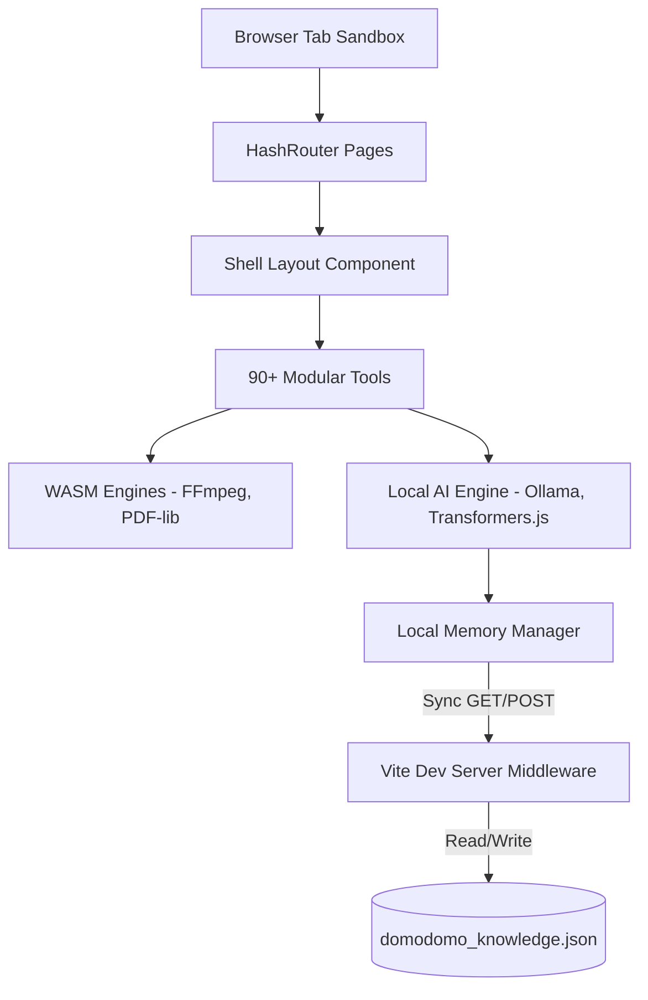

# DomoDomo System Design Document

This document outlines the architectural guidelines, design principles, styling systems, and technical details of the **DomoDomo — All-in-One Local Toolbox** application.

---

## 1. Architectural Philosophy

DomoDomo is built as a **Zero-Server, Local-First application**. The primary design constraints are:

- **Absolute Privacy**: No user file chunks, API requests for media conversion, or text extraction inputs are ever uploaded to remote servers. All processing runs inside the browser tab sandbox.
- **Client-Side Runtime Engines**: High-performance libraries are ran locally:
  - **WebAssembly (WASM)**: For heavy computations like video/audio transcoding and document processing.
  - **Transformers.js**: For offline client-side model processing (embeddings, text classification).
  - **Canvas & WebGPU**: For client-side image upscaling, background removal, and resizing.
- **Offline Resiliency**: Once cached, all static tools run successfully without an active internet connection.

---

## 2. System Architecture Layout



---

## 3. Core Modules & Utilities

### A. Modular Tool Registry
All tools are registered under a unified, schema-driven registry `src/engine/registry.ts`. Each tool is structured as:
```typescript
interface Tool {
  id: string;
  name: string;
  category: string;
  icon: string;
  description: string;
  component: React.ComponentType;
}
```


### B. Continuous Local Memory Loop
To give local LLMs context memory without cloud trackers, the app implements a secure local log loop:
1. **Activity Logger**: Log events (e.g. visiting tools, running conversions) are captured inside `localStorage`.
2. **FileSystem Backup**: When run on `localhost`, the Vite development server runs a custom API middleware (`/api/memory`) to sync logs automatically into a local ignored file: `domodomo_knowledge.json`.
3. **Prompt Augmentation**: Stored logs are formatted and injected as a system context prefix during AI chat text generation.

---

## 4. UI & Style System

DomoDomo follows a premium, futuristic dark-mode theme utilizing Tailwind CSS and custom glassmorphism layers.

### Color Palette (BrandKit)
- **Primary Background**: `#111213` (Deep Midnight Black)
- **Cards & Sections**: `#18191B` (Dark Charcoal Grey)
- **Primary Accents / Success**: `#3C6B4D` (Forest Green)
- **Secondary Accents / Attention**: `#E29E2D` (Amber Gold)
- **Borders**: `#2A2D30` (Steel Grey)
- **Text Primary**: `#ECEBE9`
- **Text Muted**: `#A3A09B`

### Styling Tokens & Layout
- **Glassmorphism Cards**: Standard cards feature `bg-[#18191B] border border-[#2A2D30] rounded-3xl p-6` to ensure maximum visual harmony and premium aesthetics.
- **Icon containers**: Wrap Lucide icons with subtle background tags (`bg-[#3C6B4D]/10 text-[#3C6B4D] border border-[#3C6B4D]/20`) for micro-highlights.
