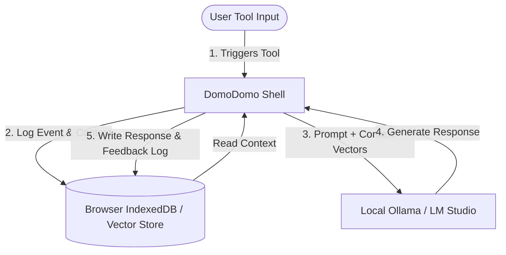

# DomoDomo Local-First Knowledge & Continuous Learning Engine

Welcome to the **DomoDomo Knowledge Base Engine**. This document details the system design, setup, and workflow to establish a local-first **read/write knowledge loop** and **continuous learning system** utilizing local LLMs (via Ollama or LM Studio) running entirely on localhost.

---

## 1. Core Architecture Overview

DomoDomo operates as a zero-server sandbox in the browser, but it has access to local LLM APIs (like Ollama on `http://localhost:11434`). To enable the local AI to remember past tasks, learn from user feedback, and access workspace context, DomoDomo implements a client-side **Retrieval-Augmented Generation (RAG)** loop.



---

## 2. Reading and Writing Knowledge

### Read Access (Workspace Context Retrieval)
When you ask a question or run an agent in the **Local AI Category**, DomoDomo:
1. Translates your prompt into an embedding vector using a local embedding model (e.g., `Xenova/all-MiniLM-L6-v2` running natively in the browser via Transformers.js).
2. Searches the local **IndexedDB** database (which contains historical interaction logs, documents, and developer code notes).
3. Pulls the top matching context blocks and automatically appends them to your prompt as a reference context for Ollama.

### Write Access (Continuous Log Collection)
Every operation inside DomoDomo (OCR extractions, PDF merges, resized image metrics, terminal command logs) is written to a local transaction log database.
- **Log Schema**:
  ```json
  {
    "timestamp": "2026-06-24T11:46:31Z",
    "toolId": "pdf-merge",
    "status": "success",
    "metadata": { "filesMerged": 3, "outputSize": "4.2MB" },
    "userNotes": "Successfully merged monthly invoices"
  }
  ```
- Ollama can inspect these logs dynamically to learn user habits (e.g. which tools are run most frequently) and recommend automations or script improvements.

---

## 3. How to Set Up the Local Knowledge Loop

To activate the write/read knowledge loops for local models:

### Step 1: Allow CORS for Ollama
Since DomoDomo runs inside a web browser, it needs permission to talk to your local Ollama port (`11434`). You must start Ollama with CORS allowed:

- **macOS**:
  ```bash
  OLLAMA_ORIGINS="*" ollama serve
  ```
- **Windows (PowerShell)**:
  ```powershell
  $env:OLLAMA_ORIGINS="*"
  ollama serve
  ```
- **Linux**:
  ```bash
  OLLAMA_ORIGINS="*" ollama serve
  ```

### Step 2: Configure Embedding Cache
Under **Settings -> Local AI Config** inside DomoDomo, toggle **Enable Offline Embeddings**. This pre-caches the MiniLM model (approx. 45MB) inside the browser cache so that embedding calculations happen instantly offline.

### Step 3: Run the Agent Hub
Open the **Domo Agent Hub** to orchestrate workflows. The agents will automatically read from `Knowledge.md` and write runtime updates back into the workspace logs.
