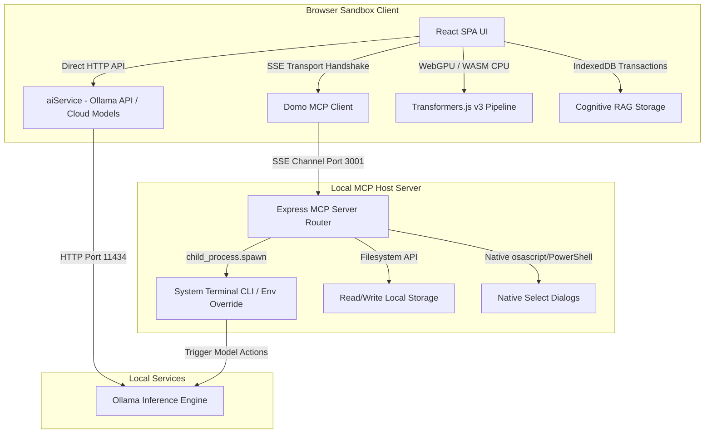
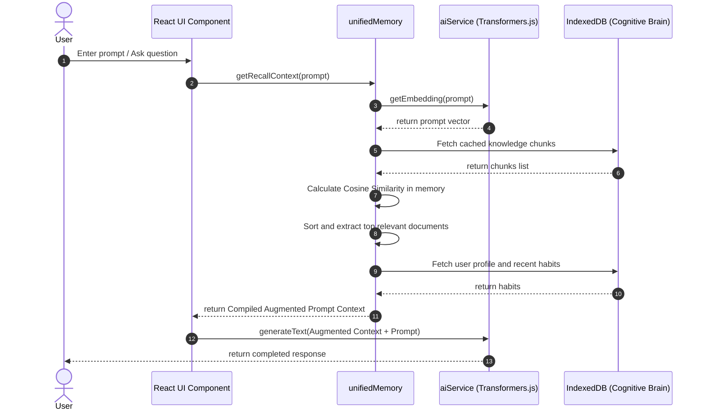

# 🐼 DomoDomo System Architecture & Execution Flow Guide

This document provides a comprehensive technical overview of DomoDomo, detailing its system architecture, execution pipelines, data flows, technology stack, and codebase layout.

---

## 1. Core Technology Stack

DomoDomo is engineered as a high-performance, local-first utility suite and agentic orchestrator. The key technologies powering this platform are:

1. **Frontend Architecture**:
   - **React 19 & TypeScript**: Provides a robust type-safe UI framework.
   - **Vite**: Used as the lightning-fast bundler and hot-module replacement dev server.
   - **Vanilla CSS & Tailwind CSS**: Tailwind is utilized for atomic, utility-first styling combined with a custom glassmorphic styling system.
   - **React Router Dom (v7)**: Manages page routing.

2. **In-Browser Compute (Offline Sandbox)**:
   - **WebAssembly (WASM)**: Executes CPU-intensive media processing, cryptography, and parsing locally (e.g., FFmpeg WASM, PDF-lib, Tesseract.js).
   - **Hugging Face Transformers.js (v3)**: Drives on-device machine learning (speech-to-text, sentiment classification, embeddings) utilizing **WebGPU Acceleration** with automatic fallback to WASM-SIMD CPU.
   - **IndexedDB**: Serves as the cognitive brain memory vault (RAG context, vector database, user habits).

3. **Local Machine Integration (Host Layer)**:
   - **Express.js MCP Server**: Establishes a Model Context Protocol (MCP) server running on `localhost:3001` via **Server-Sent Events (SSE)**.
   - **Ollama**: Interfaces with local LLMs (like Llama 3.2, Qwen 2.5) hosted on `localhost:11434`.

---

## 2. System Architecture Topography

The application implements a split runtime structure divided between a restricted web sandbox and an authorized host utility manager.



---

## 3. Core Pipelines & Data Flow

### A. Modular Tool Registration & Engine Loading
DomoDomo acts as a registry for over 110 modular utility tools. 
1. **Definition**: All tools are registered in [registry.ts](file:///Users/arronkianparejas/domodomo/src/engine/registry.ts) exposing metadata, SEO keywords, category, and target UI component.
2. **Dynamic Mounting**: The router parses the registered schema, lazy-loading the respective tool component on demand to ensure minimized initial JS bundle weight.

### B. Cognitive Recall & RAG Memory Loop
To personalize LLM interactions offline, DomoDomo maintains a local cognitive cycle:
1. **Activity Recording**: Visits and events trigger `unifiedMemory.recordAction()`, saving actions and metadata inside the `user_habits` IndexedDB store.
2. **RAG Knowledge Base**: Document uploads are chunked, embedded using an on-device model (`all-MiniLM-L6-v2`), and saved into `knowledge_chunks` IndexedDB store.
3. **Retrieval & Augmentation**: When generating text:
   - The user query is vectorized.
   - A cosine similarity search identifies relevant text records.
   - User identity, habits, and search records are compiled into a local context string.
   - The context string is prepended to the final LLM prompt.



### C. Direct-to-HDD Model Migration Pipeline
To prevent system disk exhaustion from large local models, DomoDomo enables running downloads directly to external USB/HDD locations:
1. **Direct Pulls**: The user selects a target external path.
2. **Environment Variable Injection**: The Express MCP server captures this target, clones the environment, overrides `OLLAMA_MODELS=targetPath`, and spawns the child process thread: `ollama pull <model>`.
3. **Asynchronous Polling**: Progress events from the child thread are written to a localized hidden status file (`._domo_pull_status_<jobId>.json`). The React client polls `check_pull_status` tools to render down-to-the-second progress metrics.

---

## 4. Architectural Directory Layout

```
domodomo/
├── docs/                   # System design, local AI architecture, specs, and flow docs
├── mcp-server/             # Express Node.js Model Context Protocol Server (Port 3001)
│   ├── src/
│   │   └── index.ts        # Main MCP tool executor and command gateway
│   └── package.json
├── public/                 # Static public web assets
├── scripts/                # Build and utility automation helper scripts
├── src/                    # Primary React application source
│   ├── components/         # Reusable layouts, buttons, sidebars, brand logo
│   ├── data/               # Constants and design metadata templates
│   ├── engine/             # Core tool loader and registries (registry.ts)
│   ├── pages/              # Primary route views (AppHub, ToolsHub, Settings, About)
│   ├── tools/              # 110+ specialized offline tools (ai, security, pdf, dev, etc.)
│   └── utils/              # Memory Managers (unifiedMemory.ts) and AI Service (aiService.ts)
├── package.json            # Web app dependencies & launch commands
├── tailwind.config.js      # Styling design tokens & color values
└── vite.config.ts          # Compilation configurations and development headers
```
