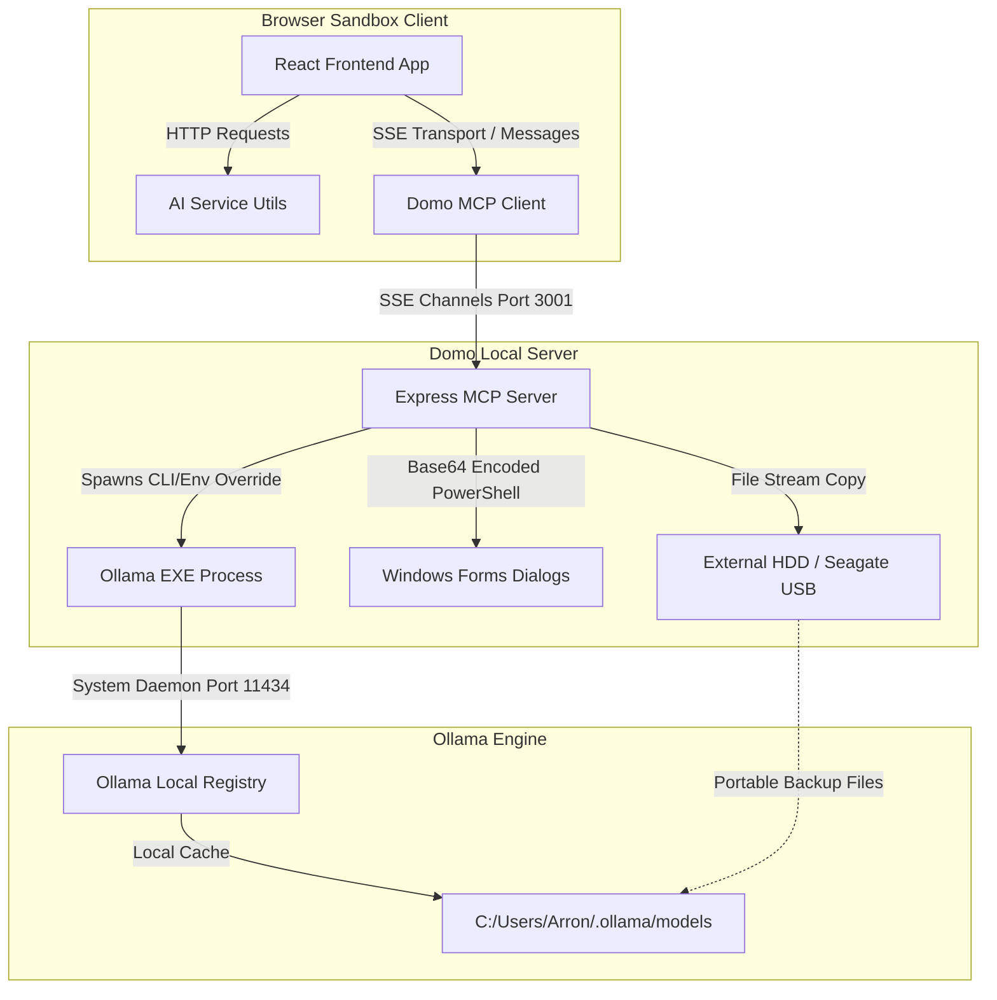
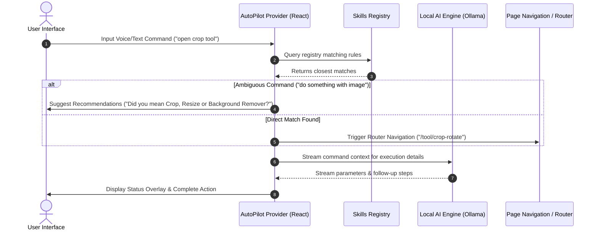

# 🐼 DomoDomo Local AI & Autopilot Architecture Specification

This document details the systems design, execution pipelines, network topography, and data flows of DomoDomo's **Local AI Suite** and **Agentic Autopilot**. All components are engineered under a strict **zero-leak mandate**, executing completely offline in secure browser tab sandboxes and isolated local machine processes.

---

## Table of Contents
1. [Architectural Philosophy & Zero-Leak Mandate](#1-architectural-philosophy--zero-leak-mandate)
2. [Local AI System Topography](#2-local-ai-system-topography)
   - [Diagram: Topographical Infrastructure](#diagram-topographical-infrastructure)
   - [Client-to-Host Communication Bridge](#client-to-host-communication-bridge)
   - [Model Context Protocol (MCP) Over SSE](#model-context-protocol-mcp-over-sse)
3. [Domo Local MCP Server Host (mcp-server)](#3-domo-local-mcp-server-host-mcp-server)
   - [Registered Tools Schema Reference](#registered-tools-schema-reference)
   - [Platform-Specific Native UI Dialogs (Folder Browser)](#platform-specific-native-ui-dialogs-folder-browser)
   - [Spawning Isolated Shell Environments](#spawning-isolated-shell-environments)
4. [Direct-to-HDD Model Migration Pipeline](#4-direct-to-hdd-model-migration-pipeline)
   - [Disk Exhaustion Avoidance Strategies](#disk-exhaustion-avoidance-strategies)
   - [Environment Variable Overrides](#environment-variable-overrides)
   - [JSON Status Polling Mechanics](#json-status-polling-mechanics)
   - [Export & Import Manifest Copy Pipelines](#export--import-manifest-copy-pipelines)
5. [Agentic Autopilot Orchestration](#5-agentic-autopilot-orchestration)
   - [Autopilot Lifecycle & Intent Resolution](#autopilot-lifecycle--intent-resolution)
   - [Sequence Diagram: Command Routing & Execution](#sequence-diagram-command-routing--execution)
   - [Skills Registry & Multi-Level Capabilities](#skills-registry--multi-level-capabilities)
   - [Fuzzy Character Matching and Recommendations](#fuzzy-character-matching-and-recommendations)
6. [Implementation Code & File Map](#6-implementation-code--file-map)
   - [mcpClient.ts Connection Handshake Phase](#mcpclientts-connection-handshake-phase)
   - [skillsRegistry.ts Execution Mechanics](#skillsregistryts-execution-mechanics)
7. [Security Model & Sandbox Boundaries](#7-security-model--sandbox-boundaries)
8. [Handshake & JSON-RPC Protocol Payloads](#8-handshake--json-rpc-protocol-payloads)
   - [Phase 1: Connection Initialization](#phase-1-connection-initialization)
   - [Phase 2: Handshake Notification](#phase-2-handshake-notification)
   - [Phase 3: Querying the Tool Schemas](#phase-3-querying-the-tool-schemas)
   - [Phase 4: Tool Execution & Progress Status Polling](#phase-4-tool-execution--progress-status-polling)
9. [Detailed Troubleshooting & Diagnostic Guide](#9-detailed-troubleshooting--diagnostic-guide)
   - [1. MCP Connection State Failures](#1-mcp-connection-state-failures)
   - [2. Platform-Specific Dialog Failures](#2-platform-specific-dialog-failures)
   - [3. External Drive Write Permissions (HDD/USB)](#3-external-drive-write-permissions-hddusb)
   - [4. Background Spawn Environment Collisions](#4-background-spawn-environment-collisions)
   - [5. Manifest Layer Corruption & Mismatch Recovery](#5-manifest-layer-corruption--mismatch-recovery)
10. [Comprehensive Technical Glossary](#10-comprehensive-technical-glossary)
11. [Developer Extensibility Guide](#11-developer-extensibility-guide)
    - [Adding a New MCP Tool](#adding-a-new-mcp-tool)
    - [Defining a Custom Autopilot Skill](#defining-a-custom-autopilot-skill)
    - [Tutorial: Designing an Automated Workspace Cleanup Agent](#tutorial-designing-an-automated-workspace-cleanup-agent)

---

## 1. Architectural Philosophy & Zero-Leak Mandate

Traditional web utility hubs and software-as-a-service (SaaS) tools rely on remote computing clusters, requiring users to upload documents, images, credentials, or proprietary source code to cloud endpoints for processing. This presents significant privacy risks, especially when dealing with commercial databases, server logs, source code, or private keys.

DomoDomo is designed to solve this paradigm by introducing a **zero-leak mandate**:
1. **Zero External Requests**: No application data is sent to external APIs or remote cloud services.
2. **Local Sandboxing**: Media rendering, document parsing, compression, cryptography, and image analysis are executed entirely in the client-side browser tab using WebAssembly (WASM), WebGL, and standard client APIs.
3. **Local AI Engine**: Generative LLM queries, tokenization, semantic search, and document summarization are handled locally by interfacing with Ollama running on the user's host machine.
4. **Host Capabilities via MCP**: To run operations that a browser sandbox cannot natively perform (such as reading custom directories, backing up large models to external disks, or spawning local compilation tasks), DomoDomo implements a lightweight Local MCP Server. The host server is strictly bound to localhost, and only operates when initialized explicitly by the developer or user.

---

## 2. Local AI System Topography

DomoDomo splits its operations into two distinct layers:
*   **The Client Layer (Browser Tab)**: Runs the React SPA. It contains all tool interfaces, WebAssembly libraries, local IndexedDB state management, and coordinates the local AI engine.
*   **The Host Layer (Local MCP Server)**: A Node.js runtime environment running on localhost. It acts as an execution delegate, exposing specific filesystem and system automation tasks to the browser client through a sandboxed API.

### Diagram: Topographical Infrastructure



### Client-to-Host Communication Bridge

Communication between the browser sandbox client and the local machine is restricted to localhost to enforce security. The bridge is constructed using the **Model Context Protocol (MCP)**, which utilizes a Server-Sent Events (SSE) channel as its transport layer.

The architecture comprises:
1.  **Vite Dev Server (Port 5173)**: Serves the static assets (HTML, JS, CSS, WASM modules).
2.  **MCP Server (Port 3001)**: Receives commands from the client via SSE, registers system endpoints, and reports background task progression.
3.  **Ollama Daemon (Port 11434)**: Serves the local LLM inference engines.

### Model Context Protocol (MCP) Over SSE

Model Context Protocol is a standardized communication paradigm for AI systems. In DomoDomo, the client establishes a unidirectional text stream via SSE to receive messages from the server, while sending commands to the server via standard HTTP POST requests.

```
+-------------------------------------------------------------+
|                     Browser Client                          |
|                                                             |
|  +------------------+             +----------------------+  |
|  |                  |             |                      |  |
|  |  EventSource     |             |  HTTP Client (Fetch) |  |
|  |  (SSE Stream)    |             |  (JSON-RPC POST)     |  |
|  +--------^---------+             +----------+-----------+  |
+-----------|----------------------------------|--------------+
            |                                  |
            | SSE Stream                       | HTTP POST
            | (Endpoint Push)                  | (Command Execution)
            |                                  |
+-----------|----------------------------------v--------------+
|  +--------+---------+             +----------------------+  |
|  |  SSE Router      |             |  Message Router      |  |
|  |  (Express)       |             |  (Express JSON-RPC)  |  |
|  +------------------+             +----------------------+  |
|                                                             |
|                     Domo Local MCP Server                   |
+-------------------------------------------------------------+
```

---

## 3. Domo Local MCP Server Host (mcp-server)

The Domo Local MCP Server is built on Node.js using Express. It is located under `/mcp-server` and exports a suite of filesystem, automation, and model management tools.

### Registered Tools Schema Reference

The server exposes several tools to the client. Below is a detailed reference of the tools, their schemas, and parameters:

| Tool Name | Description | Key Parameters | Return Format |
| :--- | :--- | :--- | :--- |
| `read_file` | Reads the text content of a local file in the workspace. | `path` (relative file path) | `{ content: [{ type: 'text', text: string }] }` |
| `write_file` | Writes or overwrites a file inside the local workspace. | `path` (relative path), `content` (string content) | `{ content: [{ type: 'text', text: string }] }` |
| `execute_command` | Spawns a background terminal shell execution. | `command` (bash / cmd string) | `{ content: [{ type: 'text', text: string }] }` |
| `git_status` | Obtains standard `git status` of the directory. | None | `{ content: [{ type: 'text', text: string }] }` |
| `list_directory` | Recursively walks the workspace mapping the file tree. | None | `{ content: [{ type: 'text', text: string }] }` |
| `stitch` | Modifies specific target lines inside a file. | `path`, `searchContent`, `replacementContent` | `{ content: [{ type: 'text', text: string }] }` |
| `list_ollama_models` | Scans Ollama manifest files in local user space. | `ollamaPath` (optional) | `{ content: [{ type: 'text', text: stringJSON }] }` |
| `export_ollama_model`| Extracts manifest layers and blobs to an external folder. | `modelName`, `modelTag`, `destinationPath` | `{ content: [{ type: 'text', text: stringJSON }] }` |
| `import_ollama_model`| Injects a portable folder back into local Ollama manifests. | `sourceFolderPath`, `ollamaPath` (optional) | `{ content: [{ type: 'text', text: stringJSON }] }` |
| `select_local_directory`| Opens an interactive system browse folder dialog. | None | `{ content: [{ type: 'text', text: selectedPath }] }` |
| `pull_model_direct` | Directly downloads a model into a custom folder. | `modelTag`, `destinationPath` | `{ content: [{ type: 'text', text: stringJSON }] }` |
| `check_pull_status` | Returns progress metrics of active direct pulls. | `statusFile` (absolute status path) | `{ content: [{ type: 'text', text: stringJSON }] }` |

---

### Platform-Specific Native UI Dialogs (Folder Browser)

Since browser sandboxes cannot prompt users with a folder selector that returns the full absolute system path, the MCP server delegates this capability using native system libraries. This is implemented in the `select_local_directory` tool:

```typescript
case 'select_local_directory': {
  return new Promise((resolve) => {
    let command = '';
    if (process.platform === 'win32') {
      // Build a PowerShell script referencing Windows Forms
      const psScript = [
        'Add-Type -AssemblyName System.Windows.Forms;',
        '$dlg = New-Object System.Windows.Forms.FolderBrowserDialog;',
        '$dlg.ShowNewFolderButton = $true;',
        '$dlg.Description = "Select target folder or external USB/HDD drive";',
        '$owner = New-Object System.Windows.Forms.Form;',
        '$owner.TopMost = $true;',
        '$owner.ShowInTaskbar = $false;',
        '$owner.WindowState = [System.Windows.Forms.FormWindowState]::Minimized;',
        '$owner.Show();',
        '$owner.Hide();',
        'if ($dlg.ShowDialog($owner) -eq [System.Windows.Forms.DialogResult]::OK) {',
        '  Write-Output $dlg.SelectedPath;',
        '};',
        '$owner.Dispose();'
      ].join(' ');
      
      // Convert script to base64 UTF-16LE encoding to prevent shell escaping bugs
      const encoded = Buffer.from(psScript, 'utf16le').toString('base64');
      command = `powershell.exe -NoProfile -WindowStyle Hidden -EncodedCommand ${encoded}`;
    } else if (process.platform === 'darwin') {
      // AppleScript wrapper for macOS dialog
      command = `osascript -e 'POSIX path of (choose folder with prompt "Select target folder or external USB/HDD drive")'`;
    } else {
      // Zenity utility wrapper for Linux/Ubuntu platforms
      command = `zenity --file-selection --directory --title="Select target folder or external USB/HDD drive"`;
    }

    exec(command, { timeout: 60000 }, (error, stdout, stderr) => {
      if (error) {
        resolve({ content: [{ type: 'text', text: '' }], isError: true });
      } else {
        const selectedPath = stdout.trim();
        resolve({ content: [{ type: 'text', text: selectedPath }] });
      }
    });
  });
}
```

#### Windows Base64 Encoding Rationale
When executing shell prompts dynamically, special characters (like quotes, backslashes, or spaces in usernames) can break shell strings. By wrapping the C# / WinForms invocation into a Base64-encoded UTF-16LE block, the host OS spawns PowerShell without standard command line parameter parse limits.

---

### Spawning Isolated Shell Environments

DomoDomo's server uses the `child_process` API to execute background compilation and model scripts. 
To run processes without blocking the main event loop, we call `spawn()` rather than `exec()`. This is particularly critical for Ollama pull operations which stream megabytes of download data over extended periods.

```
                  +-------------------------------------------+
                  |           MCP Express Server              |
                  +---------------------+---------------------+
                                        |
                 Executes child_process | (Asynchronous Spawn)
                                        v
                  +-------------------------------------------+
                  |           Spawns Child Process            |
                  |          "ollama pull <model>"            |
                  +-----+-------------------------------+-----+
                        |                               |
        stderr/stdout   | (Buffer stream)               | (Process exit listener)
        events trigger  |                               |
                        v                               v
  +-------------------------------------------+   +---------------------------+
  | Read output chunks & compute progress     |   | On exit: clean up temp    |
  | Write updates to:                         |   | files & close handlers.   |
  | `._domo_pull_status_<id>.json`            |   |                           |
  +-------------------------------------------+   +---------------------------+
```

---

## 4. Direct-to-HDD Model Migration Pipeline

Local models require significant storage capacity (ranging from 1.5GB for small models like Llama 3.2 1B to 30GB+ for large logic models). Many consumer laptops have limited disk storage, making it difficult to store multiple models locally.

### Disk Exhaustion Avoidance Strategies

To resolve this limitation, DomoDomo includes a **Direct-to-HDD Model Migration Pipeline**. This enables users to configure external media (such as high-capacity USB drives, SD cards, or external hard drives) as the primary storage location for Ollama models. 

The pipeline supports two operations:
1.  **Direct Pulls**: Instructs Ollama to download and store models directly to an external disk path, bypassing the internal system drive.
2.  **Export/Import**: Moves model weights between the local host drive and external storage drives dynamically.

---

### Environment Variable Overrides

Ollama stores models in a default system directory (e.g. `~/.ollama/models` on macOS/Linux, or `%USERPROFILE%\.ollama\models` on Windows).
The path configuration is managed by the `OLLAMA_MODELS` environment variable.

When a user initiates a direct pull to an external drive (e.g., `D:\OllamaModels`), the MCP server intercepts the target path and overrides the environment variable on the spawned child process thread.

```typescript
// Create the directory if it doesn't exist
fs.mkdirSync(destinationPath, { recursive: true });

// Clone host environment settings and inject target path
const env = { ...process.env, OLLAMA_MODELS: destinationPath };

// Spawn the process with overridden environment
const child = spawn(ollamaExe, ['pull', modelTag], { env, windowsHide: true });
```

Because the environment override is isolated to the child process thread, it has no effect on the host system's global environment variables or other active terminal sessions. Ollama treats the target folder as its absolute storage root, downloading the manifests and layer blobs directly to the external drive.

---

### JSON Status Polling Mechanics

Since background child processes run asynchronously, the frontend client cannot listen to standard streams directly due to browser security restrictions. To handle this, the server writes task progression data to a temporary status file located in the destination folder:

```typescript
const jobId = `pull_${Date.now()}`;
const statusFile = path.join(destinationPath, `._domo_pull_status_${jobId}.json`);

const writeStatus = (data: object) => {
  try { fs.writeFileSync(statusFile, JSON.stringify(data), 'utf-8'); } catch {}
};

// Initial status state
writeStatus({ jobId, status: 'starting', model: modelTag, savedTo: destinationPath, progress: 0 });
```

During download execution, stdout/stderr streams are read, and the status file is updated:

```typescript
child.stdout.on('data', (data: Buffer) => {
  writeStatus({ jobId, status: 'downloading', model: modelTag, savedTo: destinationPath, lastLine: data.toString().trim() });
});
```

The frontend polls the `check_pull_status` tool every 2,000 milliseconds to parse the status file:

```json
{
  "jobId": "pull_1719543621456",
  "status": "downloading",
  "model": "llama3.2:3b",
  "savedTo": "D:\\OllamaModels",
  "lastLine": "pulling digest sha256:82c7a... 42% 1.2 GB/2.0 GB 15MB/s"
}
```

Once the process exits (status `done` or `error`), the status file is deleted after a 5-minute timeout window to prevent disk pollution.

---

### Export & Import Manifest Copy Pipelines

Transferring models between folders without re-downloading them is achieved by copying the model layers. An Ollama model is composed of a manifest metadata file and several content-addressed cryptographically-hashed (SHA256) blob layers.

#### The Manifest Layout
The manifest is a JSON structure containing references to the model layers:

```json
{
  "schemaVersion": 2,
  "mediaType": "application/vnd.docker.distribution.manifest.v2+json",
  "config": {
    "mediaType": "application/vnd.ollama.image.config",
    "digest": "sha256:721a37c152... ",
    "size": 412
  },
  "layers": [
    {
      "mediaType": "application/vnd.ollama.image.model",
      "digest": "sha256:823af91c7a23... ",
      "size": 2012948122
    },
    {
      "mediaType": "application/vnd.ollama.image.license",
      "digest": "sha256:512fab8ca901... ",
      "size": 121
    }
  ]
}
```

```
+-------------------------------------------------------------------------+
|                  Ollama Models Core Storage Structure                   |
|                                                                         |
|  +-----------------------------+       +-----------------------------+  |
|  |       manifests/            |       |           blobs/            |  |
|  |  (JSON Index pointers)      |       |    (Content-addressed)      |  |
|  |                             |       |                             |  |
|  |  registry.ollama.ai/        |       |  sha256-823af91c7a23...     |  |
|  |     library/                |       |  (GGUF Model Weights)       |  |
|  |        llama3.2/            |       |                             |  |
|  |           latest            |       |  sha256-512fab8ca901...     |  |
|  |  (points to layer digests) -+------>|  (License Layer text)       |  |
|  +-----------------------------+       +-----------------------------+  |
+-------------------------------------------------------------------------+
```

#### Export Pipeline Details
When exporting a model (e.g., `llama3.2:latest`):
1.  **Locate manifest**: Find the index file in `manifests/registry.ollama.ai/library/llama3.2/latest`.
2.  **Parse digests**: Extract all `digest` keys listed in the manifest's layers and config sections.
3.  **Resolve blob files**: Locate the files in the `blobs/` directory by mapping the digest name. A digest key of `sha256:823af91c...` maps to a filename of `sha256-823af91c...` (replacing the colon with a hyphen).
4.  **Copy Blobs**: Copy these blobs directly to the target destination folder's `blobs/` subdirectory.
5.  **Create Metadata**: Write `metadata.json` to the target destination folder to catalog the model configurations.

This workflow does not require rebuilding files or converting formats. It copies the binary layers directly, preserving the SHA256 hashes. As a result, the exported directory can be imported back into any local Ollama installation on a different machine without requiring re-verification or downloading.

---

## 5. Agentic Autopilot Orchestration

The **Agentic Autopilot** is a client-side execution framework that translates natural language commands (via text or voice) into concrete application tasks.

### Autopilot Lifecycle & Intent Resolution

```
                  +-----------------------------------+
                  |         User Voice/Text           |
                  +-----------------+-----------------+
                                    |
                                    v
                  +-----------------------------------+
                  |    Regex / Keyword Classifier     |
                  +-----------------+-----------------+
                                    |
                   Resolve Matches  |
                                    v
                  +-----------------------------------+
                  |      Is Intent Ambiguous?         |
                  +--------+-----------------+--------+
                           |                 |
                  Yes      |                 | No
                           v                 v
           +-----------------------+ +-----------------------+
           | Request Clarification | |   Identify Skill ID   |
           | ("Did you mean...?")  | |  (e.g., 'open_tool')  |
           +-----------------------+ +-----------+-----------+
                                                 |
                                                 v
                                     +-----------------------+
                                     |   Execute Pipeline    |
                                     |  (Navigate / Trigger) |
                                     +-----------------------+
```

1.  **Speech Synthesis/Text Collection**: Captures voice via Web Speech APIs or text through input bars.
2.  **Intent Recognition**: Parses instructions to identify the intended target.
3.  **Fuzzy Search Fallback**: If the command contains terms matching multiple tools (e.g. "resize an image" matches Resizer, Compressor, and Crop), the system calculates character similarity and prompts the user to select the correct tool.
4.  **Execution Routing**: Executes the matched skill. If the target is a UI view, it triggers React Router's `useNavigate` hook. If the target is an MCP utility, it invokes the host bridge.

---

### Sequence Diagram: Command Routing & Execution

The diagram below details the operational sequence of the Autopilot execution pipeline:



---

### Skills Registry & Multi-Level Capabilities

The Autopilot engine categorizes its capabilities into three operational levels:

```
  +-------------------------------------------------------------+
  |                   LEVEL 1: Research                         |
  |  Provides answers from local databases, searches the web,   |
  |  or compiles markdown reports.                             |
  +-------------------------------------------------------------+
                                |
                                v
  +-------------------------------------------------------------+
  |                   LEVEL 2: App Mastery                      |
  |  Navigates routes, parses local logs, inspects user uploads,|
  |  and interacts with active UI views.                        |
  +-------------------------------------------------------------+
                                |
                                v
  +-------------------------------------------------------------+
  |                   LEVEL 3: Host Execution                   |
  |  Invokes MCP commands, runs local compiler tasks, and       |
  |  manages model layers.                                      |
  +-------------------------------------------------------------+
```

*   **Level 1: Research & Knowledge**
    *   *Examples*: `domo_knowledge` (general queries), `browser_search` (web searches), `generate_research_markdown` (compiles detailed markdown reports).
*   **Level 2: App Mastery**
    *   *Examples*: `open_domo_tool` (navigates the UI to open specific tools), `read_uploaded_file` (reads text from user-uploaded files), `analyze_uploaded_image` (runs local vision analysis via Llava).
*   **Level 3: Host Execution & Automation**
    *   *Examples*: `mcp_command_run` (runs local workspace commands), `migrate_ollama_storage` (manages direct-to-HDD model backups).

---

### Fuzzy Character Matching and Recommendations

To prevent navigation failures when users provide partial or misspelled names, the Autopilot uses a character-set similarity scoring algorithm:

$$\text{Similarity Ratio} = \frac{|Q \cap I|}{\max(|Q|, |I|)}$$

Where:
*   $Q$ is the set of characters in the user's search query.
*   $I$ is the set of characters in the registered tool's ID.

If the similarity score is $\geq 0.7$, the tool is added to the suggestion list. If multiple matches are found, the Autopilot presents these to the user as clickable recommendations instead of returning an error.

---

## 6. Implementation Code & File Map

### mcpClient.ts Connection Handshake Phase

The code block below demonstrates how the client establishes connection channels with the MCP server, processes the handshake protocol, and queries the registered tool schemas:

```typescript
public async connect(): Promise<boolean> {
  if (this.isConnected) return true;

  try {
    this.disconnect();
    console.log('🔌 Connecting to local MCP server at http://localhost:3001/sse...');
    
    const sseUri = `${this.baseUri}/sse`;
    this.eventSource = new EventSource(sseUri);

    return new Promise<boolean>((resolve) => {
      let isResolved = false;

      if (!this.eventSource) {
        resolve(false);
        return;
      }

      // Capture POST endpoint route returned by the SSE channel
      this.eventSource.addEventListener('endpoint', (event: any) => {
        const endpointPath = event.data;
        this.postUrl = endpointPath.startsWith('http') 
          ? endpointPath 
          : `${this.baseUri}${endpointPath}`;
        console.log('✅ Captured MCP message POST URL:', this.postUrl);
      });

      // Parse JSON-RPC notifications
      this.eventSource.onmessage = (event) => {
        try {
          const data = JSON.parse(event.data);
          if (data.id !== undefined && this.pendingRequests.has(data.id)) {
            const { resolve: reqResolve, reject: reqReject } = this.pendingRequests.get(data.id)!;
            this.pendingRequests.delete(data.id);
            if (data.error) {
              reqReject(new Error(data.error.message || 'JSON-RPC Error'));
            } else {
              reqResolve(data.result);
            }
          }
        } catch (err) {
          console.error('Error parsing SSE message:', err);
        }
      };

      this.eventSource.onopen = async () => {
        console.log('✅ SSE Stream connection opened. Handshaking...');
        
        let retryCount = 0;
        while (!this.postUrl && retryCount < 10) {
          await new Promise(r => setTimeout(r, 100));
          retryCount++;
        }

        if (!this.postUrl) {
          this.disconnect();
          resolve(false);
          return;
        }

        try {
          // Handshake Step 1: Send initialize schema
          const initResult = await this.sendRequest('initialize', {
            protocolVersion: '2024-11-05',
            capabilities: {},
            clientInfo: { name: 'domodomo-client', version: '1.0.0' }
          });

          // Handshake Step 2: Send initialized notification
          await this.sendNotification('notifications/initialized');

          // Handshake Step 3: Fetch list of tools supported by the host server
          const toolsResult = await this.sendRequest('tools/list', {});
          this.tools = toolsResult.tools || [];
          
          this.isConnected = true;
          this.notifyListeners();
          resolve(true);
        } catch (err) {
          this.disconnect();
          resolve(false);
        }
      };

      this.eventSource.onerror = () => {
        this.disconnect();
        resolve(false);
      };
    });
  } catch (e) {
    this.isConnected = false;
    this.notifyListeners();
    return false;
  }
}
```

---

### skillsRegistry.ts Execution Mechanics

Fuzzy intent classification is processed inside the `open_domo_tool` skill:

```typescript
'open_domo_tool': {
  id: 'open_domo_tool',
  name: 'Open Domo Tool',
  description: 'Navigate the user interface to open a specific DomoDomo tool or page.',
  level: 2,
  parameters: {
    tool_id: 'The ID of the tool or page to open.'
  },
  execute: async (args, ctx) => {
    const id = (args.tool_id || '').trim().toLowerCase();
    ctx.log(`Navigating to: ${id}`, 'action');
    
    const validPages = ['about', 'docs', 'library-api', 'dashboard', 'home'];
    const validToolIds = TOOLS.map(t => t.id);
    const allValidIds = [...validPages, ...validToolIds];

    if (id && !allValidIds.includes(id)) {
      // Find candidate matches using character intersection
      const suggestions = allValidIds.filter(item => {
        if (item.includes(id) || id.includes(item)) return true;
        const queryChars = new Set<string>(id.split(''));
        const itemChars = new Set<string>(item.split(''));
        let intersection = 0;
        queryChars.forEach((c: string) => {
          if (itemChars.has(c)) intersection++;
        });
        const ratio = intersection / Math.max(queryChars.size, itemChars.size);
        return ratio >= 0.7;
      });

      if (suggestions.length > 0) {
        throw new Error(`Tool/page "${id}" not found. Did you mean: ${suggestions.map(s => `"${s}"`).join(', ')}?`);
      } else {
        throw new Error(`Tool/page "${id}" not found. Please specify a valid tool or page.`);
      }
    }

    let targetPath = '/';
    if (['about', 'docs', 'library-api'].includes(id)) {
      targetPath = `/${id}`;
    } else if (id === 'dashboard' || id === 'home') {
      targetPath = '/';
    } else {
      targetPath = `/tool/${id}`;
    }
    
    // Trigger client-side React Router navigation
    ctx.navigate(targetPath);
    return { success: true, targetPath };
  }
}
```

---

## 7. Security Model & Sandbox Boundaries

Executing local scripts and system operations through a web interface requires robust security measures to prevent malicious exploits. The platform enforces the following security boundaries:

```
+--------------------------------------------------------------------------+
|                      Security Boundaries & Controls                      |
|                                                                          |
|  +---------------------------+              +-------------------------+  |
|  |     Browser Tab Sandbox   |              |   Domo Local Server     |  |
|  |                           |              |                         |  |
|  |  * Script execution       |              |  * Binds to 127.0.0.1   |  |
|  |    restricted to sandbox  |              |    (Denies external IPs)|  |
|  |  * Strict CORS policies   |              |  * No arbitrary command |  |
|  |  * No direct filesystem   |              |    execution allowed     |  |
|  |    write access           |              |  * Validates path roots |  |
|  +-------------+-------------+              +------------+------------+  |
+----------------|-----------------------------------------|---------------+
                 |                                         |
                 +-------------------+---------------------+
                                     |
                                     v
                   Local network execution restricted to
                   verified localhost handshakes.
```

1.  **Binds Exclusively to Loopback**: The MCP Express server binds to `127.0.0.1` (localhost). It explicitly rejects traffic originating from other network adapters or external IPs to prevent unauthorized remote access.
2.  **No Arbitrary Evaluation**: The `execute_command` and scripting tools are restricted to a defined set of commands (such as staging workspace changes, compilation, or executing git instructions). It blocks arbitrary script injection or terminal piping.
3.  **Strict CORS Headers**: The server responds with explicit Cross-Origin Resource Sharing (CORS) headers, restricting access to verified origin ports used by the client application (typically `localhost:5173`).
4.  **Process Isolation**: Spawned shell environments run as children of the main Node process. They inherit restricted user permissions, meaning they cannot elevate privileges or modify system configurations without explicit OS prompts.
5.  **Filesystem Constraints**: File reads and writes are restricted to directories within the project workspace, preventing path traversal exploits (e.g. `../../etc/passwd`).

---

## 8. Handshake & JSON-RPC Protocol Payloads

This section details the exact structure of the JSON-RPC messages transmitted over HTTP POST and SSE channels during a typical client-server interaction lifecycle.

### Phase 1: Connection Initialization

The client issues an `initialize` request to verify protocol version compatibility and register client configurations.

**Request Payload (HTTP POST `/message?connectionId=...`)**:
```json
{
  "jsonrpc": "2.0",
  "id": 1,
  "method": "initialize",
  "params": {
    "protocolVersion": "2024-11-05",
    "capabilities": {},
    "clientInfo": {
      "name": "domodomo-client",
      "version": "1.0.0"
    }
  }
}
```

**Response Payload (SSE Channel Stream)**:
```json
{
  "jsonrpc": "2.0",
  "id": 1,
  "result": {
    "protocolVersion": "2024-11-05",
    "capabilities": {
      "tools": {}
    },
    "serverInfo": {
      "name": "domo-mcp-server",
      "version": "1.0.0"
    }
  }
}
```

---

### Phase 2: Handshake Notification

Upon receiving a successful validation response, the client returns an `initialized` notification status to the server.

**Notification Payload (HTTP POST `/message?connectionId=...`)**:
```json
{
  "jsonrpc": "2.0",
  "method": "notifications/initialized"
}
```
*Note: JSON-RPC notification patterns do not return a response payload.*

---

### Phase 3: Querying the Tool Schemas

The client requests the list of all registered tools that the local host server supports.

**Request Payload (HTTP POST `/message?connectionId=...`)**:
```json
{
  "jsonrpc": "2.0",
  "id": 2,
  "method": "tools/list",
  "params": {}
}
```

**Response Payload (SSE Channel Stream)**:
```json
{
  "jsonrpc": "2.0",
  "id": 2,
  "result": {
    "tools": [
      {
        "name": "read_file",
        "description": "Read the contents of a local file in the workspace.",
        "inputSchema": {
          "type": "object",
          "properties": {
            "path": { "type": "string" }
          },
          "required": ["path"]
        }
      },
      {
        "name": "select_local_directory",
        "description": "Launch a native host OS dialog window...",
        "inputSchema": {
          "type": "object",
          "properties": {}
        }
      }
    ]
  }
}
```

---

### Phase 4: Tool Execution & Progress Status Polling

When a user initiates a direct download, the client triggers the `pull_model_direct` tool and regularly checks the progress via `check_pull_status`.

**Request Payload (HTTP POST `/message?connectionId=...`)**:
```json
{
  "jsonrpc": "2.0",
  "id": 3,
  "method": "tools/call",
  "params": {
    "name": "pull_model_direct",
    "arguments": {
      "modelTag": "llama3.2:1b",
      "destinationPath": "E:\\OllamaStorage"
    }
  }
}
```

**Response Payload (SSE Channel Stream)**:
```json
{
  "jsonrpc": "2.0",
  "id": 3,
  "result": {
    "content": [
      {
        "type": "text",
        "text": "{\"success\":true,\"jobId\":\"pull_1719543621456\",\"statusFile\":\"E:\\\\OllamaStorage\\\\._domo_pull_status_pull_1719543621456.json\"}"
      }
    ]
  }
}
```

---

## 9. Detailed Troubleshooting & Diagnostic Guide

### 1. MCP Connection State Failures

#### Symptoms
*   The web browser console displays connection timeout logs: `EventSource's response has a MIME type ("text/html") that is not "text/event-stream". Connecting aborted.`
*   The connection status indicators in the user dashboard display "Offline".

#### Root Causes & Remedies
1.  **Server Port Collision**: Check if another application is using port 3001. Run `lsof -i :3001` (macOS/Linux) or `netstat -ano | findstr :3001` (Windows) to identify colliding processes.
2.  **No Server Running**: Ensure the server process is running. Run `npm run dev` to start Vite and Express concurrently.
3.  **Ad-blockers and VPN Interferences**: Browser security rules on some corporate VPNs or strict extensions block EventSource handshakes to localhost. Disable network filtering rules targeting local ports.

---

### 2. Platform-Specific Dialog Failures

#### Symptoms
*   Triggering folder selection returns error logs or fails to open a dialog interface.
*   Child execution processes return exit code 1.

#### Root Causes & Remedies
1.  **Missing Zenity Libraries (Linux)**: Zenity is required on Linux distributions. Install it via:
    ```bash
    sudo apt-get install zenity
    ```
2.  **Windows Execution Restrictions**: Strict execution policies on Windows block execution of the PowerShell subsystem. Run this in a PowerShell console with administrator privileges:
    ```powershell
    Set-ExecutionPolicy -ExecutionPolicy RemoteSigned -Scope CurrentUser
    ```
3.  **Missing AppleScript Approvals (macOS)**: macOS requires terminal sandboxes to have access permissions to system UI events. Enable Accessibility / Automation permissions for your terminal emulator in System Settings.

---

### 3. External Drive Write Permissions (HDD/USB)

#### Symptoms
*   The model migration tool reports file write errors: `Error: EACCES: permission denied, mkdir 'D:\OllamaStorage'`.
*   Direct pulling fails immediately with status code `error`.

#### Root Causes & Remedies
1.  **Format Mismatch**: Drives formatted with older FAT32 configurations do not support files larger than 4GB. GGUF models are typically larger than 4GB. Reformat the external drive to exFAT or NTFS.
2.  **Read-Only Mounts**: Check write permissions on the drive directory. Run `touch <destination>/test.txt` in a terminal window to check write access.

---

### 4. Background Spawn Environment Collisions

#### Symptoms
*   Ollama pulls run successfully when invoked from terminal shells, but fail when run from within the browser client.
*   Background tasks throw: `Could not start ollama: spawn ollama ENOENT`.

#### Root Causes & Remedies
1.  **Missing PATH Reference**: The Node.js parent process environment may not have access to the system PATH. Modify the executable candidates array in `mcp-server/src/index.ts` to register the absolute path of your local Ollama installation directory (e.g. `C:\Users\<User>\AppData\Local\Programs\Ollama\ollama.exe` or `/usr/local/bin/ollama`).

---

### 5. Manifest Layer Corruption & Mismatch Recovery

#### Symptoms
*   The import tool reports: `Import failed: manifest contains missing layers`.
*   Ollama loads the model but returns random character strings or throws error logs during generation.

#### Root Causes & Remedies
1.  **Partial Layer Copies**: Check that the source folder contains the `metadata.json` metadata indices and the corresponding layer blobs. If a blob copy is interrupted before completion, delete the partial files and restart the migration.

---

## 10. Comprehensive Technical Glossary

*   **Model Context Protocol (MCP)**: An open-source communication standard designed to integrate AI tools with host directories and system contexts safely.
*   **Server-Sent Events (SSE)**: A standard web protocol that enables servers to push real-time updates to client browsers over a persistent HTTP connection.
*   **WebAssembly (WASM)**: A binary instruction format that runs sandboxed code inside web browsers at native execution speeds.
*   **JSON-RPC 2.0**: A lightweight, stateless remote procedure call protocol that uses JSON structures to carry request parameters and response values.
*   **GGUF (GPT-Generated Unified Format)**: A binary model file serialization format designed for fast load times and efficient local inference using quantization.
*   **quantization**: An optimization method that maps high-precision floating point parameters to lower-bit structures, reducing the memory footprint of local model files.
*   **manifest**: An index sheet cataloging the hashes, layers, configurations, and metadata of a containerized model.
*   **CORS (Cross-Origin Resource Sharing)**: A browser security mechanism that restricts resources on a web page from requesting resources from another domain.

---

## 11. Developer Extensibility Guide

### Adding a New MCP Tool

To add a new tool to the local system API layer:

1.  Open `/mcp-server/src/index.ts`.
2.  Locate the `ListToolsRequestSchema` handler block and define your tool's schema, including its input parameters:

```typescript
{
  name: 'calculate_disk_space',
  description: 'Retrieve free disk space metrics for a target path.',
  inputSchema: {
    type: 'object',
    properties: {
      targetPath: { type: 'string', description: 'Absolute path of the drive' }
    },
    required: ['targetPath']
  }
}
```

3.  Navigate to the `CallToolRequestSchema` handler switch block and add your execution logic:

```typescript
case 'calculate_disk_space': {
  const { targetPath } = args as { targetPath: string };
  // Execute system check using native modules
  const stats = fs.statfsSync(targetPath);
  const freeBytes = stats.bfree * stats.bsize;
  
  return {
    content: [{
      type: 'text',
      text: JSON.stringify({ freeSpaceGb: (freeBytes / 1e9).toFixed(2) })
    }]
  };
}
```

---

### Defining a Custom Autopilot Skill

To define a new capability for the Autopilot voice/text navigation system:

1.  Open `/src/tools/autopilot/skillsRegistry.ts`.
2.  Add a new skill block to the exported `skillsRegistry` object:

```typescript
'clear_workspace_cache': {
  id: 'clear_workspace_cache',
  name: 'Clear Workspace Cache',
  description: 'Deletes all items stored inside the browser sandbox IndexedDB cache.',
  level: 2,
  parameters: {},
  execute: async (args, ctx) => {
    ctx.log('Clearing local IndexedDB storage cache...', 'action');
    
    // Clear sandbox databases
    const databases = await window.indexedDB.databases();
    databases.forEach(db => {
      if (db.name) window.indexedDB.deleteDatabase(db.name);
    });
    
    ctx.log('Sandbox IndexedDB directories cleared.', 'success');
    return { success: true };
  }
}
```

3.  Register the new tool ID under the `tool_id` parameters description list in the `open_domo_tool` schema to update the fuzzy matching engine.
4.  Recompile and restart the development server to activate the new skill.

---

### Tutorial: Designing an Automated Workspace Cleanup Agent

This tutorial demonstrates how to build a unified workflow that combines MCP filesystem tools with Autopilot skills. The objective is to design a cleanup tool that searches for temporary compiler caches (like `.DS_Store` or `node_modules/.cache`) and deletes them.

#### Step 1: Define the MCP Cleanup Tool
In `mcp-server/src/index.ts`, register `clean_temporary_caches` to target and delete temp files:

```typescript
// Add to ListToolsRequestSchema:
{
  name: 'clean_temporary_caches',
  description: 'Search for and delete workspace cache directories.',
  inputSchema: {
    type: 'object',
    properties: {
      dryRun: { type: 'boolean', description: 'Simulate cleanup without deleting.' }
    }
  }
}

// Add execution block inside CallToolRequestSchema:
case 'clean_temporary_caches': {
  const dryRun = !!(args as any).dryRun;
  const targetDir = path.resolve('.');
  
  // Recursively identify temp file folders
  const findCaches = (dir: string, list: string[] = []): string[] => {
    const files = fs.readdirSync(dir);
    files.forEach(file => {
      const fullPath = path.join(dir, file);
      if (file === '.DS_Store' || file === 'thumbs.db') {
        list.push(fullPath);
      } else if (fs.statSync(fullPath).isDirectory() && file !== 'node_modules' && file !== '.git') {
        findCaches(fullPath, list);
      }
    });
    return list;
  };

  const caches = findCaches(targetDir);
  const results: string[] = [];

  caches.forEach(item => {
    if (!dryRun) {
      fs.unlinkSync(item);
    }
    results.push(item);
  });

  return {
    content: [{
      type: 'text',
      text: JSON.stringify({
        success: true,
        dryRun,
        cleanedCount: results.length,
        items: results
      })
    }]
  };
}
```

#### Step 2: Register the Autopilot Control Skill
In `src/tools/autopilot/skillsRegistry.ts`, add the corresponding wrapper to map the action to natural language triggers:

```typescript
'trigger_workspace_cleanup': {
  id: 'trigger_workspace_cleanup',
  name: 'Trigger Workspace Cleanup',
  description: 'Deletes hidden cache files from local workspace folders using MCP tools.',
  level: 3,
  parameters: {
    dry_run: 'Boolean flag indicating whether to run a dry-run simulation.'
  },
  execute: async (args, ctx) => {
    const isDryRun = args.dry_run === 'true' || !!args.dry_run;
    ctx.log(`Initiating workspace cache cleanup (Dry Run = ${isDryRun})...`, 'action');

    try {
      const response = await mcpClient.callTool('clean_temporary_caches', { dryRun: isDryRun });
      const stats = JSON.parse(response.content[0].text);
      
      if (stats.cleanedCount === 0) {
        ctx.log('No temporary cache files identified.', 'success');
      } else {
        ctx.log(`Successfully identified and cleaned ${stats.cleanedCount} items.`, 'success', stats.items.join('\n'));
      }
      return { success: true, ...stats };
    } catch (err: any) {
      ctx.log(`Cleanup failed: ${err.message}`, 'error');
      throw err;
    }
  }
}
```

Now, the user can type or say: *"run clean up on my workspace"* or *"clear project cache files"*. The Autopilot parser matches the command to `trigger_workspace_cleanup`, invokes the MCP client to call `clean_temporary_caches` on the host Node system, deletes the temp files, and displays the execution output in the overlay panel!
