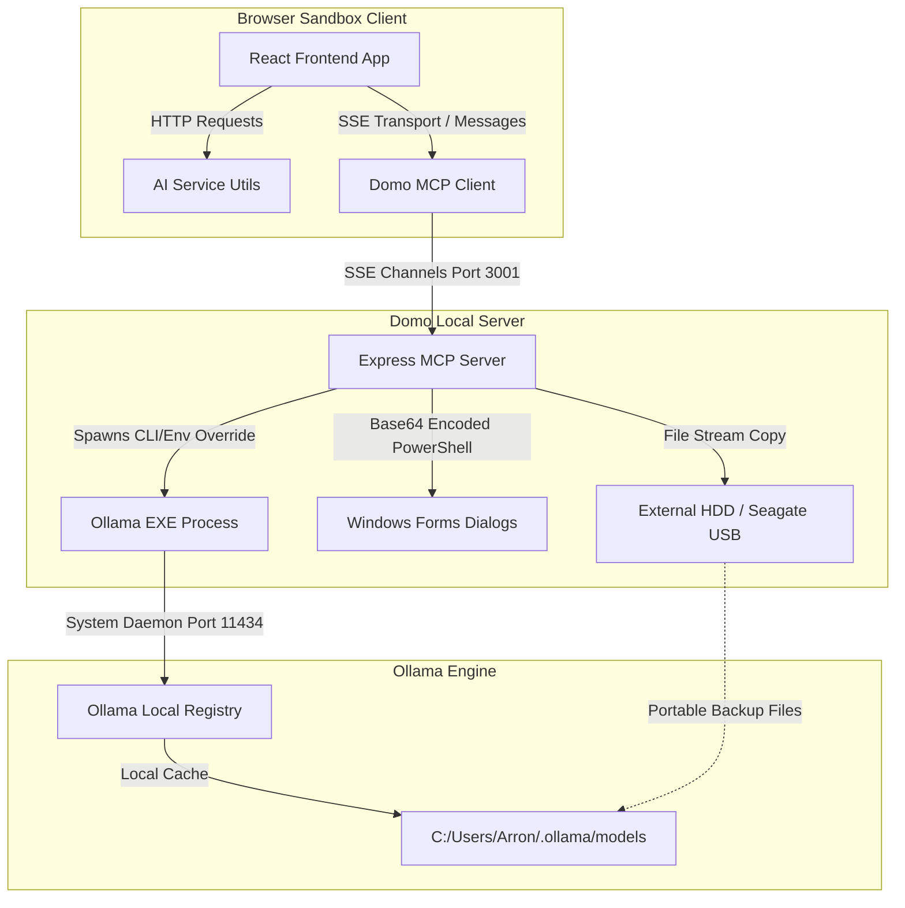
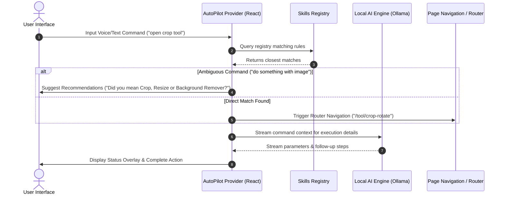
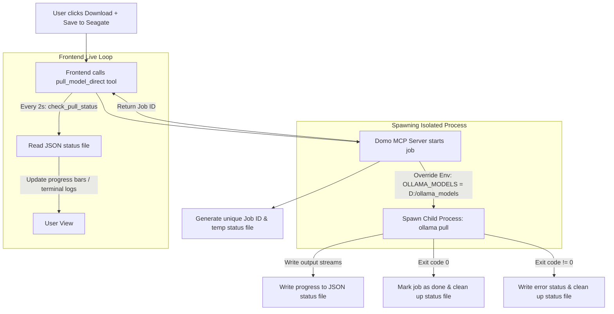

# 🐼 DomoDomo Local AI & Autopilot Architecture Specification

This document details the systems design, execution pipelines, and data flows of DomoDomo's **Local AI Suite** and **Agentic Autopilot**. All components are engineered under a **zero-leak mandate**, executing offline in browser sandboxes and local machine processes.

---

## 1. Local AI System Topography
The system utilizes a client-to-host architecture bridged via Model Context Protocol (MCP) over Server-Sent Events (SSE). This allows the browser-native React client to control native system APIs (e.g. file systems, external HDDs, and Ollama shell processes) without cloud dependencies.

---

## 2. Agentic Autopilot Orchestration
The Autopilot is a multi-turn voice and text task agent that navigates the dashboard, triggers tools, and recommends relevant utilities when instructions are ambiguous.

---

## 3. Direct-to-HDD Model Migration Pipeline
To prevent laptop space exhaustion, the model migrator supports direct-to-drive downloads. It bypasses internal disks by overriding environmental variables on spawned threads.

---

## 4. Components Directory Summary
* **`/src/tools/ai/ModelMigrator.tsx`**: Visual control dashboard managing registry catalog, imports, exports, and direct HDD pulling.
* **`/mcp-server/src/index.ts`**: Host-level dispatcher managing file copy loops, base64-encoded PowerShell system dialogue wrappers, and background spawns.
* **`/src/tools/autopilot`**: Contains `AutoPilotProvider.tsx`, `AutoPilotWorkspace.tsx`, and `skillsRegistry.ts` organizing nav targets and local intent resolution.
