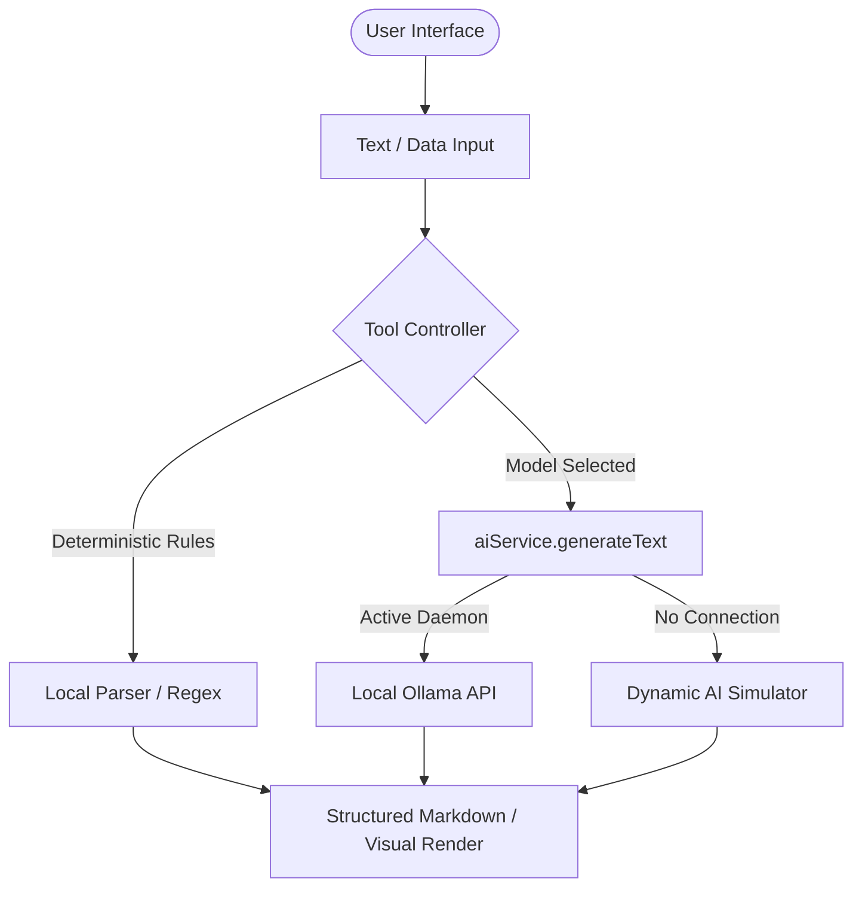

# Technical Specification: Offline Investigative Research Suite

The Offline Investigative Research Suite provides 10 first-class client-side tools to help academics, clinical researchers, patent attorneys, and legal investigators parse texts, audit references, map patents, and design experiments locally.

## Architecture

## Supported Tools

1. **Scientific Literature Synthesizer**: Parses academic text to extract hypotheses, methodology, and limitations.
2. **Clinical Trial Evaluator**: Evaluates clinical protocols, cohort sizes, and efficacy endpoints.
3. **Patent Claim Mapper**: Visualizes claim hierarchies using text-based ASCII trees.
4. **Historical Archive Cross-Examiner**: Contrasts timelines and ideological bias across primary accounts.
5. **Academic Citation Cross-Referencer**: Audits referencing styling against APA, MLA, IEEE, or Chicago standards.
6. **Research Hypothesis Generator**: Brainstorms testable hypotheses and suggests control setups.
7. **Qualitative Text Coder & Labeler**: Tags transcript data, counts codes, and extracts themes.
8. **Research Method Advisory**: Advises on statistical test selection and sample size calculations.
9. **Meta-Analysis Statistics Aggregator**: Aggregates effect sizes and renders visual Forest Plots via SVG.
10. **Funding Proposal Optimizer**: Optimizes grant drafts against rubric criteria.

## Security & Compliance
All processing occurs client-side. The tools do not transmit pasted academic materials, patent specs, or sensitive clinical trials data outside of localhost.
